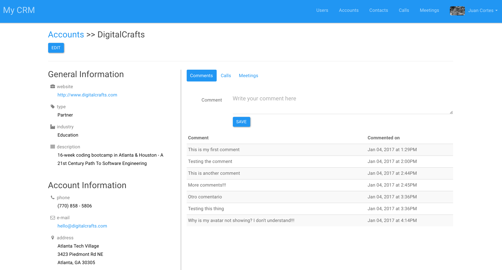
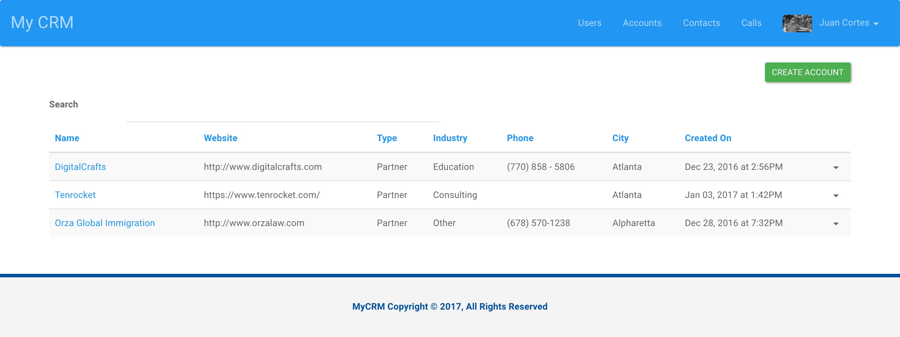
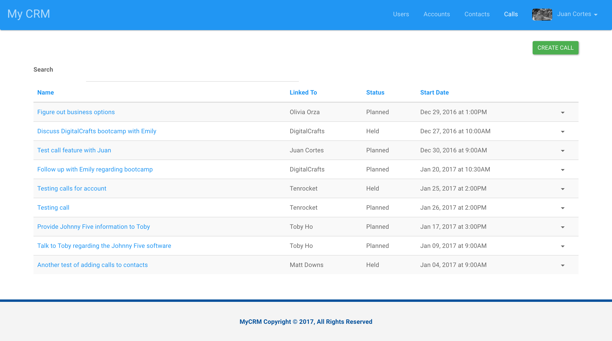
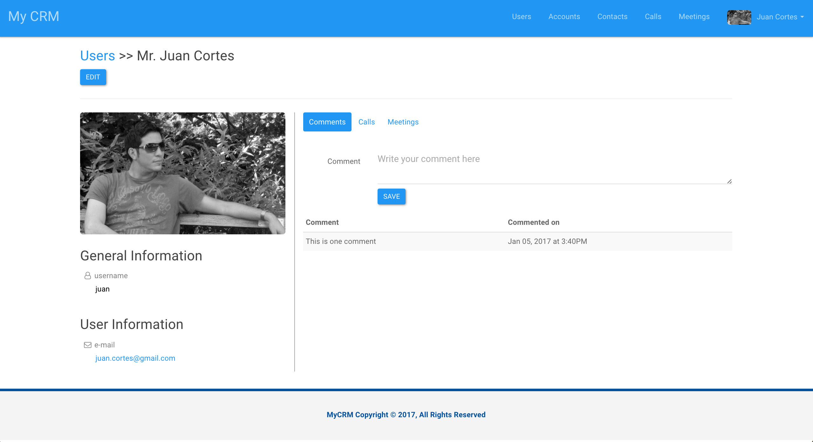

# MyCRM

######
[Live Project](http://54.148.11.254:3000)   |   [Overview](https://github.com/jcortes0309/mongo_crm/#overview)   |   [What I Used](https://github.com/jcortes0309/mongo_crm/#what-i-used)   |  [Screenshots](https://github.com/jcortes0309/mongo_crm/#screenshots)   | [Project History](https://github.com/jcortes0309/mongo_crm/#project-history)

## Overview:
MyCRM is an application that allows you to enter, see and evaluate all your company relationships in one place regardless of the relationship type.  Accounts, contacts, calls or meetings information can be easily accessed using your preferred device.

## What I used:
**Languages:**  
* HTML5
* CSS
* JavaScript (MEAN Stack)

**Frameworks:**  
* Angular JS 1.6.0 (including the following services: ui-router, ngCookies, ngTouch, ngAnimate, angularFileUpload)
* Express JS
* Bootstrap

**Other:**  
* MongoDB
* Node JS
* Amazon Web Services EC2

## Screenshots
**Account's Page**

**Accounts List**

**Calls List**

**User Profile Page**

## Project History
01/10/2017 - Project Presentation @ DigitalCrafts graduation  
12/19/2016 - Project Start
